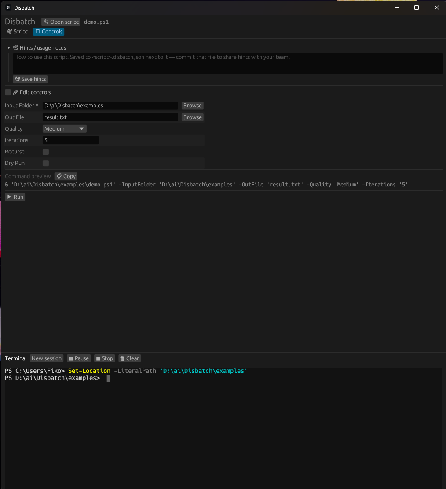
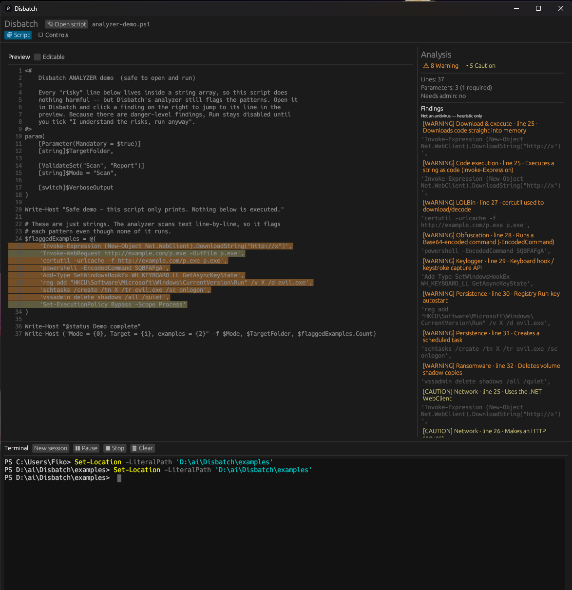
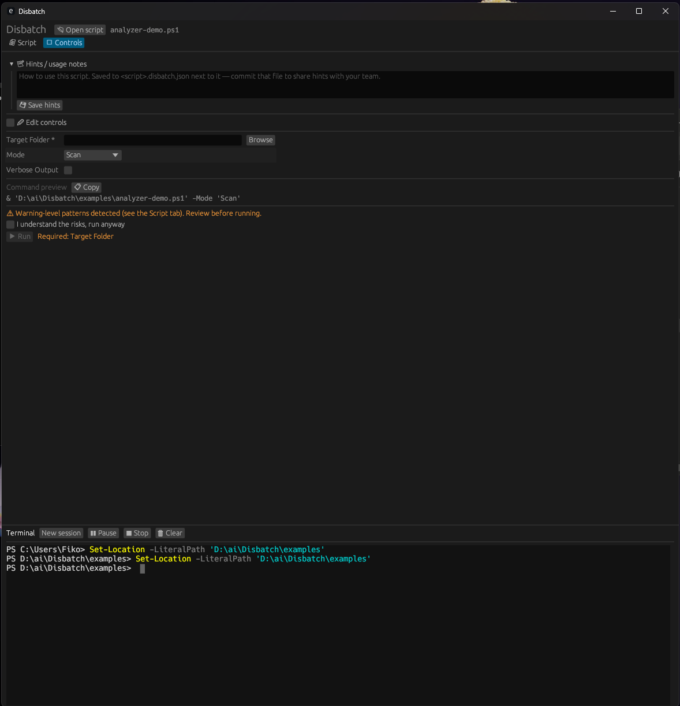
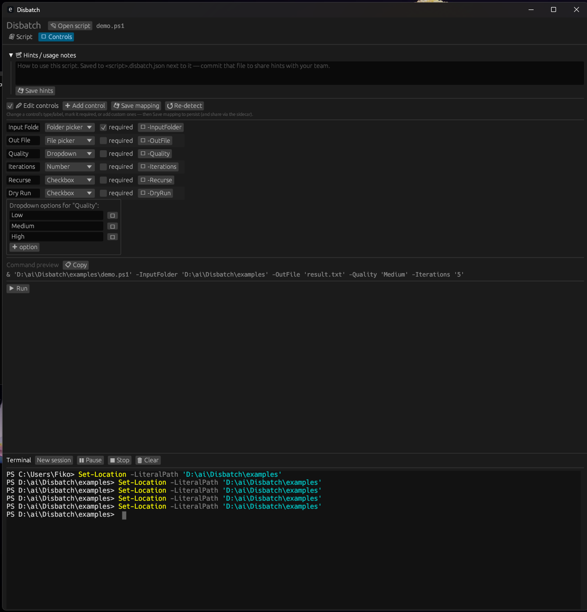
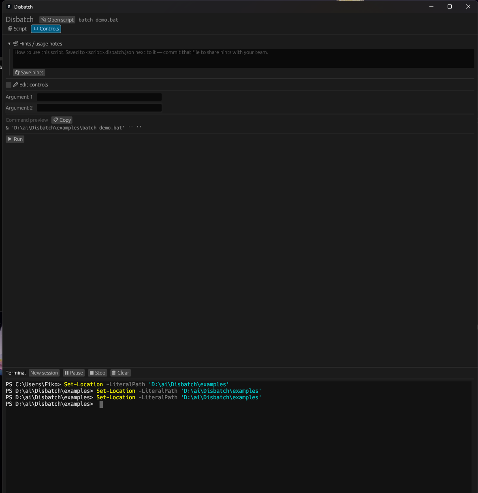
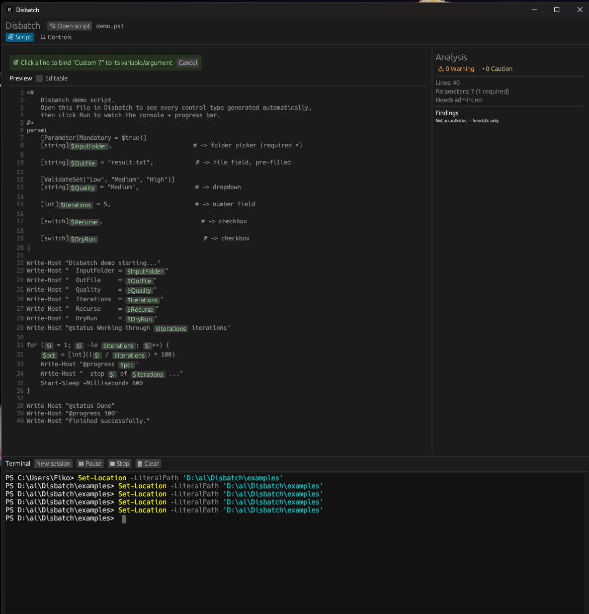
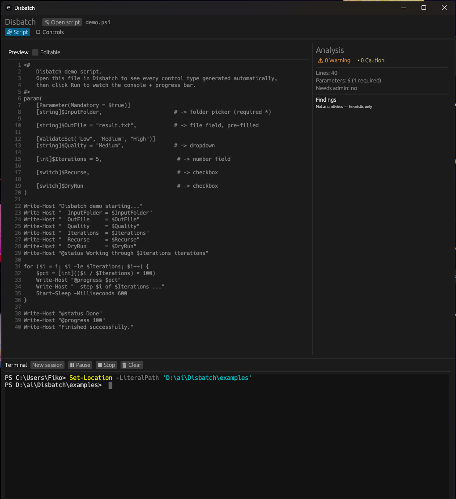
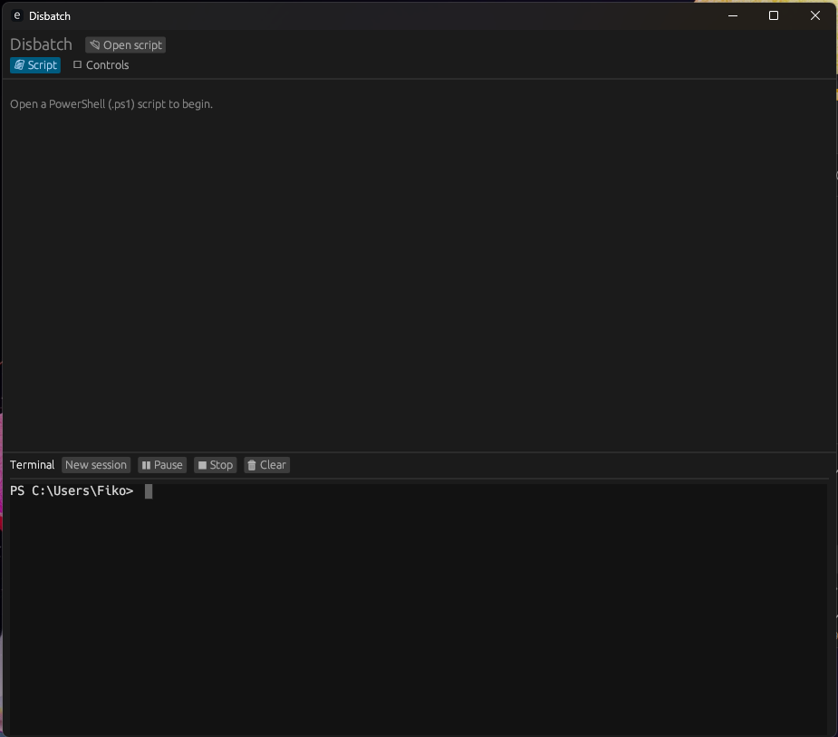

# Disbatch

**Give your scripts an instant GUI.** Point Disbatch at a `.ps1` (or `.bat`/`.cmd`)
and it reads the script's parameters, generates the matching controls — folder
pickers, checkboxes, dropdowns, number and text fields — statically analyses the
script for risky behaviour, and runs it inside a live embedded terminal with a
progress bar. One self-contained Windows `.exe`, **100% offline**, no runtime to
install.

> ⚠️ **"Vibecoded" — use with caution.** Disbatch was built quickly and iteratively
> (largely with an AI coding assistant) as a personal project. It works, but it has
> **not** been hardened, audited, or extensively tested. Run it at your own risk —
> especially when pointing it at scripts you don't fully trust. The built-in risk
> analyzer is a heuristic aid, **not** a security guarantee.

## Screenshots

**Open a script → get a GUI.** Every control is generated from the script's
`param()` block; the live command preview shows exactly what will run.



**Built-in risk analysis.** Risky lines are tinted inline, and the panel lists
every finding (Warning / Caution) with its line — click one to jump to it.
*(Heuristic, not antivirus.)*



**Risk-gated Run.** When the analyzer flags Warning-level patterns, Run stays
disabled until you tick the acknowledgment — and required fields must be filled
first. *(Heuristic, not antivirus.)*



**The mapper.** Fix what auto-detection missed — change a control's type/label,
mark it required, edit dropdown options, add custom controls, and bind each to
the exact `$variable` / `%N` token in the script.



**Batch files too.** A `.bat`'s `%1` / `%2` are detected as ordered arguments.



**Pick-to-bind.** Adding or fixing a control? Click the exact `$variable` (or a
`%N` in a batch file) it should drive — the green chips mark every bindable
token, so there's no guessing.



**Read-only preview + analysis** — the Script tab pairs a soft-wrapping preview
with the findings panel (this demo is clean: 0 findings).



**A real embedded terminal** (the same ConPTY mechanism Windows Terminal uses)
is live from launch, with Pause / Stop / Clear and a progress bar.



## Features

- **Auto-generated UI** — a PowerShell `param()` block (or a `.bat`'s `%1`/`%2`
  positional args) becomes a form, no config required.
- **Two tabs**
  - **Script** — read-only, soft-wrapping preview with risky lines tinted inline and
    a risk-analysis panel + metrics. Click a finding to jump to its line.
  - **Controls** — the generated form, a live command preview (with **Copy**), and Run.
- **Embedded ConPTY terminal** — a real, interactive PowerShell terminal (the same
  pseudo-console mechanism Windows Terminal uses), rendered inside the app. Run sends
  the composed command into it; you can also type in it directly.
  - **Pause / Resume** freezes the running script exactly where it is (OS-level thread
    suspend) and continues from that point; **Stop** sends Ctrl+C; **Clear** wipes the
    screen.
- **Risk analyzer** — flags risky capabilities (download-and-run, encoded commands,
  keyboard hooks, persistence, shadow-copy deletion, …) at two levels: **Warning**
  (gates the Run button until you acknowledge) and **Caution** (FYI). Click a chip to
  filter. *Heuristic, not antivirus* — expect false positives and false negatives.
- **Mapper** — fix what auto-detection missed: change a control's type/label, mark it
  required, add custom controls, and **pick-to-bind** by clicking the exact
  `$variable` / `%N` / `set VAR` / `$env:VAR` token in the script. Fill dropdown
  options by hand.
- **Hints & remembered values** — per-script notes and your last-used input values are
  saved to a `<script>.disbatch.json` sidecar next to the script.
- **Progress bar** — driven by an opt-in `@progress` / `@status` protocol.
- **Drag-and-drop** a script onto the window to open it.
- **Dark, offline, single exe** — no telemetry, no network calls, nothing to install.
  (It does write one local file: the per-script `.disbatch.json` sidecar described below.)

## How parameters map to controls

| PowerShell                         | Control          |
| ---------------------------------- | ---------------- |
| `[switch]$Recurse`                 | checkbox         |
| `[ValidateSet("A","B")][string]$X` | dropdown         |
| `[int]$Threads = 4`                | number field (4) |
| `[string]$InputFolder`             | folder picker    |
| `[string]$LogFile` / `...Path`     | file picker      |
| `[string]$Name`                    | text field       |
| `[Parameter(Mandatory)]`           | required *       |

Batch files expose their `%1`, `%2`, … as ordered arguments. Anything auto-detection
gets wrong, fix in the **mapper** (✏ Edit controls on the Controls tab). Defaults
pre-fill the controls; mandatory parameters must be set before Run.

## Progress + status protocol (opt-in)

Print these from your script and Disbatch drives the bar (the lines also appear in
the terminal):

```powershell
Write-Host "@progress 42"           # 0-100 -> progress bar
Write-Host "@status Copying files"  # -> status label
```

```bat
echo @progress 42
echo @status Copying files
```

## Sidecar (`<script>.disbatch.json`)

Saved next to the script, holding team-shareable hints, your mapper control
definitions, and remembered input values. Commit it alongside the script and whoever
opens it next gets the same hints and controls.

> ⚠️ **The sidecar stores your entered values in plaintext.** Disbatch will **not**
> save (and masks in the UI) values for parameters whose name looks sensitive —
> `password`, `secret`, `token`, `apikey`, `credential`, … — but that is a heuristic,
> not a guarantee. **Review the file before committing**, and add `*.disbatch.json` to
> your `.gitignore` if it could ever hold something you wouldn't put in version
> control. (A value you type also appears in the on-screen command preview and in the
> terminal / PowerShell history when the script runs — inherent to passing it as a
> command-line argument.)

## Build & run

Requires the Rust toolchain (the repo pins the MSVC toolchain via
`rust-toolchain.toml`).

```powershell
cargo run --release      # build + launch
cargo build --release    # -> target\release\disbatch.exe (single file)
```

Try `examples\demo.ps1` (every control type), `examples\analyzer-demo.ps1` (the risk
analyzer + pick-to-bind), or `examples\batch-demo.bat` (positional args), then **Run**.

## Safety note

Disbatch makes running scripts frictionless — which is exactly when it's easy to run
something you shouldn't. The risk analyzer is a speed-bump and an informed-consent
layer; it is **not** a replacement for antivirus, and obfuscated code can evade it.
Read what a script does before you run it.

## Roadmap

- Batch `set /p` / `set VAR=` auto-detection (today only `%N` auto-detects; env vars
  are reachable via the mapper's pick-to-bind).
- Whole-process-tree pause (today Pause freezes the shell; child processes it spawned
  keep running).
- Recent-files list and reopen-last-script.

## License

[MIT](LICENSE) © 2026 SlashRevet
